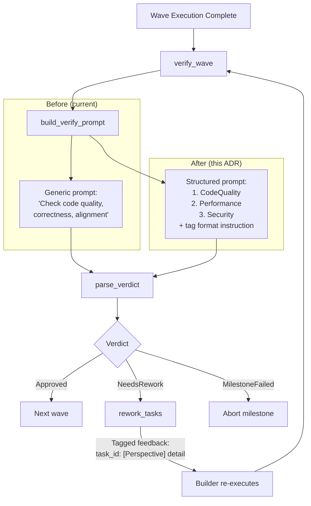

# 1. Verifier 3観点検証の強化

Date: 2026-03-20

Owner: ymdvsymd

## Status

Accepted

## Context

Ralph モードの VerifierAgent は、Wave 完了後にコード品質を検証する役割を担う。現在の実装（`src/ralph/verifier.mbt` の `build_verify_prompt()`）では、以下の汎用プロンプトを使用している:

> "Check code quality, correctness, and alignment with the milestone goal"

一方、通常モードの ReviewAgent（`src/review/review.mbt`）は、3つの明示的な観点（CodeQuality / Performance / Security）ごとに専用プロンプトを構築し、それぞれ個別に LLM を呼び出す構造化された評価を実施している。

### 現状比較

| Item | ReviewAgent (normal mode) | VerifierAgent (Ralph mode) |
|------|---------------------------|---------------------------|
| LLM calls | 3 per task | 1 per wave |
| Perspective separation | Explicit (dedicated prompt per perspective) | None (generic prompt) |
| Feedback tags | `[CodeQuality]`, `[Performance]`, `[Security]` | None |
| Scope | Single task | Entire wave (milestone-aware) |

### 問題

VerifierAgent の汎用プロンプトでは、LLM が暗黙的に品質チェックの観点を選択するため、以下のリスクがある:

- **観点の欠落**: Security や Performance が一切チェックされないケースがある
- **フィードバックの曖昧さ**: `rework_tasks()` が受け取るフィードバックに観点情報がなく、Builder が修正の優先度を判断しにくい
- **再現性の低下**: 同じコードに対する検証結果がプロンプトの解釈に依存して変動する

## Decision

### 選択肢

3つのアプローチを検討した:

| Approach | LLM calls | Cost | Perspective coverage |
|----------|-----------|------|---------------------|
| Status quo (generic single prompt) | 1 per wave | 1x | Implicit |
| **Option 1: Prompt enhancement (adopted)** | **1 per wave** | **1x** | **Explicit** |
| Option 2: Full 3-perspective (3 calls) | 3 per wave | 3x | Maximum |

### 採用: Option 1 — プロンプト強化

1回の LLM 呼び出しの中で3観点を明示的に指示する。コスト増なしで観点カバレッジを改善する。

Option 2（ReviewAgent と同じ3回呼び出し）は、Wave 全体を対象とする VerifierAgent の特性上コストが3倍になるが、観点カバレッジの優位性は限定的である。Option 1 導入後にフィードバックの観点タグ出現率が30%未満であれば、Option 2 へのエスカレーションを検討する。

### 実装方針

#### 1. `build_verify_prompt()` の更新 (`src/ralph/verifier.mbt`)

プロンプトに以下の3観点を明示的に追加する:

```
Review each task result from the following three perspectives:

1. [CodeQuality] — Readability, naming, error handling, test coverage
2. [Performance] — Algorithmic complexity, unnecessary allocations, N+1 queries, caching
3. [Security] — Input validation, injection, authentication/authorization, sensitive data exposure

For each issue found, format feedback as:
  task_id: [Perspective] description
```

#### 2. フィードバック形式

Verifier の出力例:

```
<needs_rework>
m1-t1: [Security] SQL injection check missing in user input handler
m1-t2: [Performance] O(n^2) loop can be replaced with hash lookup
m1-t1: [CodeQuality] Error from parse_config() is silently ignored
</needs_rework>
```

#### 3. 既存コードへの影響

`rework_tasks()`（`src/ralph/ralph_loop.mbt`）は変更不要。理由:

- 観点タグ `[Security]` 等はフィードバック文字列の一部として埋め込まれる
- `strip_task_feedback_prefix()` は `task_id:` プレフィックスのみを除去し、残りのテキスト（タグ含む）をそのまま Builder に渡す
- Builder は観点タグ付きフィードバックをコンテキストとして受け取り、修正の方向性を判断できる

#### 4. テスト追加 (`src/ralph/verifier_test.mbt`)

- 観点タグ付きフィードバックの `parse_verdict()` テスト
- 複数観点が混在するフィードバックの分割テスト

### アーキテクチャ変更



## Consequences

### 改善される点

- **観点カバレッジの向上**: 3観点が必ずチェックされ、Security や Performance の見落としが減少する
- **フィードバックの構造化**: `[Perspective]` タグにより Builder が修正の種別を認識でき、的確な修正が期待できる
- **コスト据え置き**: LLM 呼び出し回数は1回/Wave のまま変わらない
- **後方互換性**: `rework_tasks()` と `strip_task_feedback_prefix()` は変更不要

### リスクと対策

| Risk | Mitigation |
|------|-----------|
| LLM may not consistently emit perspective tags | Monitor tag occurrence rate; escalate to Option 2 if below 30% |
| Single prompt may be too long for complex waves | Wave already batches task results; prompt size increase is minimal (~200 tokens) |
| Perspective tag format may conflict with task output | Tags use bracket format `[X]` distinct from XML tags used for verdict parsing |

### エスカレーション基準

導入後、以下の条件で Option 2（3回呼び出し）へのエスカレーションを検討する:

- フィードバック中の観点タグ（`[CodeQuality]`, `[Performance]`, `[Security]`）の出現率が **30%未満**
- 特定の観点（特に Security）が継続的に欠落する傾向が確認された場合
